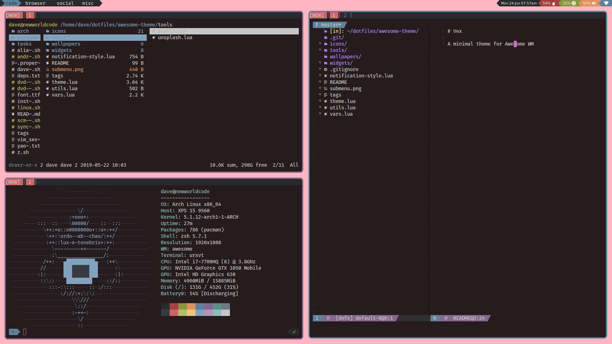

# Vex

A minimal theme for Awesome WM.

### Installation

`git clone https://github.com/davemackintosh/vex.git ~/.config/awesome/themes/vex`

And then load the theme in your `~/config/awesome/rc.lua`

```lua
beautiful.init("~/.config/awesome/themes/vex/theme.lua")
```




# LICENCES

* MIT license for theme
* Material Icons (./icons/) [Apache License 2.0](https://github.com/google/material-design-icons/blob/master/LICENSE)

## My .dotfiles

You can find more about my setup in my [dotfiles repo.](https://github.com/davemackintosh/dotfiles)

It contains all the hot keys I use, the varying other things I have set up to make Awesome work the way I like it to.


